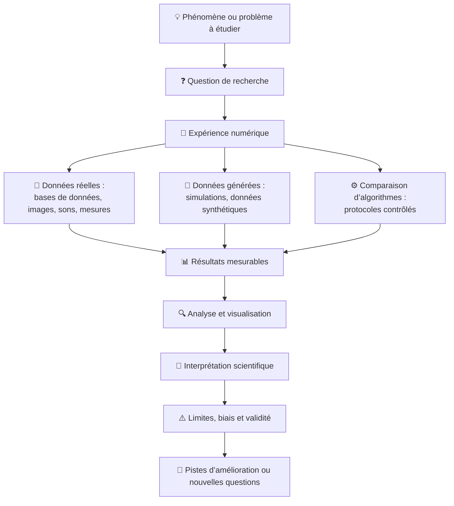

:::info-nt
### 🎯 Objectifs
Aujourd'hui, vous allez :
- comprendre ce qu’est un **projet scientifique** en informatique
- former une **équipe de travail**
- explorer des **pistes de projets**
- identifier des **sources de données potentielles**
- amorcer une **démarche scientifique réaliste**
:::

::::note-nt
## 🗓️ Déroulement d'une semaine

Votre projet scientifique se déroule sur **15 semaines**. 
Chaque semaine, vous aurez environ **6 heures** à consacrer au projet, réparties comme suit :

### ⏳ Temps en classe (3 heures)
:::danger Rencontres hebdomadaires obligatoires
Chaque semaine, je rencontrerai chaque équipe environ 15 minutes pour :
- faire le point sur l'avancement du projet
- discuter des difficultés rencontrées
- valider les choix méthodologiques
- orienter la démarche scientifique
- soutenir la progression du projet
- valider les prochaines étapes
- échanger des idées
- etc.

👉 Référez-vous à la section [Rencontres hebdomadaires](/methodes/rencontres) pour vous aider à bien préparer ces rencontres.
:::

:::tip-nt
Vous passerez le reste du temps de cours à travailler en équipe sur votre projet.
:::

:::info-nt
👉 À la fin de chaque cours, avant de quitter, vous devez déterminer clairement les tâches de chaque membre de l’équipe d’ici à la prochaine rencontre.

Chaque membre consignera brièvement son travail et ses prochaines étapes dans son **journal de bord individuel** dans le repo GitHub de l’équipe.

📌 Les consignes et le format du journal sont présentés dans la section [Exploration et cadrage du projet](/cours/semaine2#-journal-de-bord-individuel).
:::

---

### ⏳ Travail entre les cours (3 heures)
:::tip-nt
En plus du travail en classe, vous devrez aussi consacrer du temps (environ 3 heures) entre les cours pour :
- avancer sur les tâches assignées
- faire des recherches sur des aspects spécifiques du projet
- préparer la prochaine rencontre avec moi
:::

:::info-nt
👉 Il vous est aussi possible de vous faire des rencontres d'équipe en dehors des heures de cours lorsque nécessaire.
:::
::::

:::info-nt
## 🧠 Projet scientifique en informatique
Un projet scientifique en informatique ne consiste **pas** simplement à programmer une application ou à apprendre une nouvelle technologie.

Il repose sur la mise en place d’une **expérience numérique**, qui peut prendre différentes formes :
- l’analyse de **données réelles existantes** (bases de données, images, sons, mesures, etc.)
- la **génération de données** par simulation ou par modèles
- la **comparaison d’algorithmes ou de méthodes** à l’aide de protocoles contrôlés

Dans tous les cas, le projet doit produire des **résultats mesurables**, qui seront analysés, interprétés et discutés de façon rigoureuse.

👉 Peu importe l’approche choisie, on doit toujours retrouver :
- une **question de recherche**
- un **protocole** (comment l’expérience est réalisée)
- des **résultats observables**
- une **analyse critique des limites**

---

### 🧭 Démarche scientifique

:::

---

:::info-nt
## 🧮 Évaluations

Votre note finale au cours sera composée des évaluations suivantes :

| Évaluation | Individuelle | En équipe |
|---------------------------------------|:-----------:|:---------:|
| [Exploration et cadrage du projet](/cours/semaine2) | 10% | |
| [Proposition de projet](/cours/semaine5) | | 10% |
| [Présentation du projet proposé](/cours/semaine6) | 10% | |
| [Développement et analyse](/cours/semaine7) | 15% | |
| [Article scientifique](/cours/semaine13) | | 25% |
| [Présentation finale](/cours/semaine14) | 20% | |
| [Auto-évaluation](/cours/semaine15) | 10% | |
| **Total** | **65%** | **35%** |

Les grilles d’évaluation et les consignes détaillées sont disponibles sur la page de chaque évaluation.
:::

---

::::tip-nt
## 👥 Formation des équipes
- Les équipes seront composées de **3 personnes**
- Si le nombre total `n` d’étudiant.e.s dans la classe n’est pas un multiple de 3 (`n % 3 != 0`) :
  - si `n % 3 == 2`, alors **1 équipe de 2** sera aussi formée
  - si `n % 3 == 1`, alors **2 équipes de 2** seront aussi formées
- Vous devez m'indiquer vos équipes **avant la fin du cours aujourd'hui**.

👉 Travaillez avec des personnes :
- avec qui vous pouvez communiquer facilement
- avec qui vous êtes capables de vous organiser
- qui ont des forces complémentaires

:::warning-nt
### 🐙 Repo GitHub
Chaque équipe devra créer un **repo GitHub commun** pour le projet.  

Aussitôt votre équipe formée :
- **Un membre** doit [créer le repo GitHub et inviter les autres membres de l’équipe à y collaborer](https://info.cegepmontpetit.ca/420-SN1/recettes/creer-repertoire-github).
- Tous les membres de l’équipe doivent avoir des **droits d’écriture** sur ce repo.
- Votre repo doit être **privé** pour protéger la confidentialité de votre travail.
- Vous devez aussi m’inviter comme collaborateur!
  - avant de la fin du cours aujourd'hui 
  - je vais écrire mon nom d’utilisateur GitHub sur le tableau
  :::
  ::::

:::info-nt
## 🧪 Projets proposés
[Plusieurs projets](/projets/projets) vous sont proposés comme **points de départ**.  
Chaque projet :
- est volontairement **ouvert**
- peut être abordé selon différents angles
- devra être **délimité et validé**

👉 Vous n’êtes **pas obligés** de suivre un projet à la lettre : vous devrez le **transformer en question de recherche** adaptée à vos intérêts et aux données disponibles.

👉 Vous pouvez aussi proposer un **projet original** qui n’est pas dans la liste, mais il devra être **validé par moi** avant d’être poursuivi.
:::

:::tip-nt
## 🔍 Exploration initiale
En équipe :

1. Parcourez les projets proposés sur le site du cours  
2. Discutez d'autres idées de projets qui pourraient vous intéresser
3. Retenez **2 à 3 projets** à explorer plus en détail (y compris des projets hors liste)
4. Pour chacun, discutez :
   - du phénomène étudié
   - du type de données possibles
   - des [questions de recherche](/methodes/questions-recherche) envisageables
   - de ce que vous comprenez… et de ce qui est flou

👉 L’objectif n’est **pas** de décider définitivement, mais d’explorer.
:::

::::info-nt
## 📂 Sources de données
Certains projets de recherche en informatique ne nécessitent pas de données réelles (ex. simulations, protocoles contrôlés).  

Cependant, la plupart des projets **s’appuient sur des données existantes**.
Pour de tels projets, les équipes sont responsables de **chercher des sources de données** pour leur projet.

Vous pouvez utiliser :
- des portails de données ouvertes
- des bases de données scientifiques accessibles
- des jeux de données institutionnels
- des données issues de projets de recherche ou de vulgarisation

👉 À ce stade, il ne s’agit **pas** d’analyser les données, mais de vérifier :
- qu’elles existent
- qu’elles sont accessibles
- qu’elles semblent exploitables

Voici quelques exemples de sources de données ouvertes qui pourraient vous être utiles :
- Données gouvernementales :
  - [Données Québec](https://www.donneesquebec.ca/)
  - [Gouvernement ouvert](https://ouvert.canada.ca/) (Canada)
  - [Data.gov](https://www.data.gov/) (États-Unis)
- Données scientifiques institutionnelles :
  - [NASA Open Data](https://data.nasa.gov/)
  - [Global Biodiversity Information Facility](https://www.gbif.org/)
  - [USGS – Seismology](https://earthquake.usgs.gov/)
- Répertoires de jeux de données pour l’apprentissage automatique :
  - [UCI Machine Learning Repository](https://archive.ics.uci.edu/ml/index.php)
  - [Kaggle Datasets](https://www.kaggle.com/datasets)
- Plateformes de dépôt de données de recherche :
  - [Zenodo](https://zenodo.org/)
  - [Figshare](https://figshare.com/)
- Moteur de recherche de jeux de données :
  - [Google Dataset Search](https://datasetsearch.research.google.com/)

👉 Toutes les sources ne sont pas également documentées ou adaptées à un projet scientifique. La **qualité**, la **provenance** et la **compréhension** des données sont plus importantes que leur **quantité**.

👉 Lisez la section [Comment évaluer la qualité d’un jeu de données?](/methodes/source-donnees) pour vous guider dans cette démarche.

:::warning-nt
### ✅ Validation des données
Les sources de données devront être **validées par moi** le plus tôt possible dans le projet.

Vous devez être en mesure de préciser :
- la provenance des données
- le type de données (texte, image, audio, numérique, etc.)
- le volume approximatif
- les conditions d’utilisation (si connues)

👉 Pour vous aider à garder un projet réaliste, si une source de données ne semble pas appropriée, le projet devra être ajusté ou redéfini.
:::
::::

:::tip-nt
## 👉 Pour la semaine prochaine
Pour la rencontre de votre équipe avec moi la semaine prochaine, vous devez être prêts à présenter :
- le projet sur lequel vous vous êtes mis d’accord d'explorer (si vous avez fait un choix)
  - ça peut être un projet proposé ou une idée originale de votre équipe
- deux projets entre lesquels vous hésitez (si vous n’avez pas fait de choix définitif)
- pour chaque projet retenu :
  - une description du phénomène ou problème à étudier
  - des pistes de [sources de données](/methodes/source-donnees) potentielles
  - des idées de [questions de recherche](/methodes/questions-recherche) possibles
:::
